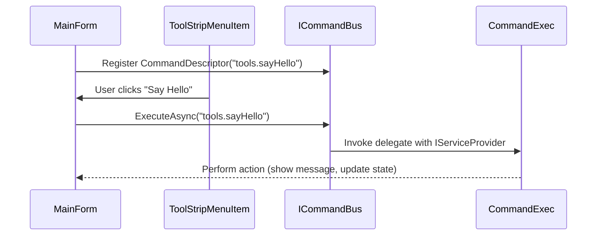

#pp Command Bus

The **Command Bus** is AppAlling’s central mechanism for decoupling user actions (menu clicks, hotkeys, plugin requests) from the logic that executes them.

It provides a **publish/execute** pipeline where commands are described by metadata and invoked dynamically at runtime.

## Core Concepts

### CommandDescriptor

A command is described by an immutable record:

```csharp
public sealed record CommandDescriptor(
    string Id,
    string Title,
    string? Shortcut = null
);
```

* **Id** – Globally unique identifier (e.g. `"tools.sayHello"`).
* **Title** – Human-readable label used in menus, toolbars, etc.
* **Shortcut** – Optional accelerator key (e.g. `"Ctrl+T"`).

---

### ICommandBus

The `ICommandBus` interface is responsible for:

* **Registering** commands with execution delegates
* **Executing** commands on demand
* **Listing** available commands for menus and key bindings

```csharp
public interface ICommandBus
{
    IReadOnlyDictionary<string, CommandDescriptor> List { get; }
    void Register(CommandDescriptor descriptor, Func<IServiceProvider, Task> execute);
    Task ExecuteAsync(string id, IServiceProvider sp);
}
```

---

### Command Execution

At runtime, plugins (or the host application) register commands with the bus:

```csharp
var bus = new CommandBus();
bus.Register(new CommandDescriptor("tools.sayHello", "Say Hello"), sp =>
{
    Console.WriteLine("Hello from plugin!");
    return Task.CompletedTask;
});
```

The command can later be invoked from anywhere:

```csharp
await bus.ExecuteAsync("tools.sayHello", serviceProvider);
```

---

## Example Flow



---

## Tool Window Integration

Tool windows are automatically mapped to "Open" commands:

```csharp
foreach (var tw in tools.SelectMany(t => t.DescribeToolWindows()))
{
    var desc = new CommandDescriptor(tw.CommandId, $"Open {tw.Title}");
    bus.Register(desc, async sp =>
    {
        var factory = CommandRegistry.ResolveToolWindowFactory(sp, tw.CommandId);
        factory().Show();
        await Task.CompletedTask;
    });
}
```

This means **menus and hotkeys can open tool windows without manual wiring**.

---

## Reactive Benefits

Since commands are described declaratively:

* Menus and toolbars can **auto-populate** based on the `List` property.
* Commands can be re-bound or overridden at runtime.
* Tests can verify that commands were executed without needing UI automation.

---

## Best Practices

* **Keep handlers small** – Defer complex logic to services resolved from DI.
* **Use unique IDs** – Prefer namespace-style (e.g. `pluginname.feature.action`).
* **Support async** – Handlers return `Task` to avoid blocking UI.
* **Combine with state store** – Use `IStore<TState>` to mutate global state in response to commands.

---

## Example: Plugin Command

```csharp
public sealed class HelloWorldPlugin : ICommandContribution
{
    public IEnumerable<CommandDescriptor> DescribeCommands() =>
    [
        new("tools.sayHello", "Say Hello"),
        new("view.toggleTheme", "Toggle Theme", "Ctrl+T")
    ];

    public void ConfigureServices(IServiceCollection services, IPluginContext ctx)
    {
        services.AddSingleton<ICommandExec>(
            new Exec("tools.sayHello", _ =>
            {
                MessageBox.Show("Hello from HelloWorld plugin!");
                return Task.CompletedTask;
            }));
    }
}
```

---

## Related Topics

* [State Store](state-store.md)
* [Architecture Overview](overview.md)
* [Menu Composer](menu-composer.md)


