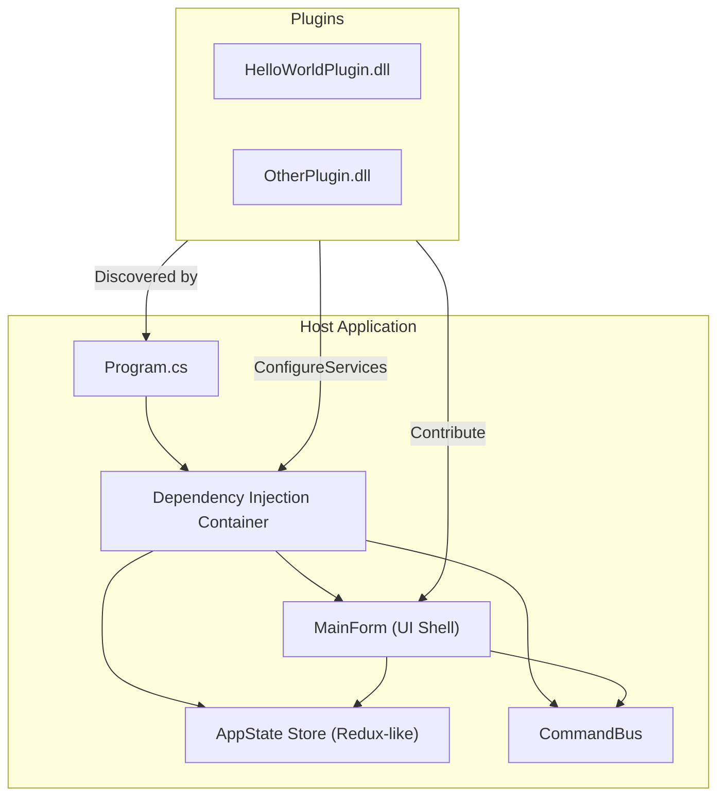

# Architecture Overview

AppAlling is designed as a modular, extensible, and **plugin-driven** WinForms application.  
Its architecture is inspired by Clean Architecture and emphasizes **separation of concerns**, **testability**, and **reactive UI updates**.

---

## High-Level Diagram


---

## Core Layers

### 1. **Application Layer (`AppAlling.Application`)**

* **State Store** – Implements a Redux-like pattern (`IStore<AppState>`) with reducers in `Reducers.Root`.
* **Command Bus** – A centralized registry of `CommandDescriptor` → execution delegates.
* **Actions** – Immutable actions used to update state.

### 2. **UI Layer (`AppAlling.UI.WinForms`)**

* **MainForm** – A data-driven UI shell that:

    * Dynamically builds menus from contributed models.
    * Registers commands from plugins.
    * Reacts to state changes (e.g., theme switching).
* **MenuComposer** – Merges menu roots and attaches click handlers safely.
* **Tool Windows** – Lightweight forms contributed by plugins and opened via implicit commands.

### 3. **Plugin Host (`AppAlling.PluginHost`)**

* **PluginLoader** – Scans a directory for assemblies, loads `IAppallingPlugin` implementations, and calls `ConfigureServices` on each.
* **Plugin Contexts** – Provide plugin-specific root directory and contextual information.

### 4. **Plugins (`AppAlling.Plugins.*`)**

* Provide contributions:

    * `ICommandContribution`
    * `IMenuModelContribution`
    * `IToolWindowContribution`
* Register executors (e.g., `ICommandExec`) and tool window factories.

---

## Key Design Goals

* **Extensibility** – New functionality is added via plugins, not by modifying the core host.
* **Reactive UI** – The `Store` emits state updates as `IObservable<AppState>` streams.
* **Testability** – Nearly every component is covered by BDD-style acceptance tests with [TinyBDD](https://github.com/JerrettDavis/TinyBDD/).
* **Separation of Concerns** – Business logic and UI are decoupled via DI and event streams.
* **Deterministic Composition** – All menus, commands, and windows are constructed at runtime based on contributions.

---

## Dependency Injection Flow

1. `Program.cs` builds a `ServiceCollection`.
2. Registers core application services with `.AddAppAllingApplication()`.
3. Registers UI services with `.AddAppAllingUiWinForms(configuration)`.
4. Uses `PluginLoader` to discover and configure plugins.
5. Builds a `ServiceProvider`, which is used to construct `MainForm`.

---

## Testing Strategy

* **Unit Tests:** Verify reducers, command bus, and individual contributions.
* **Acceptance Tests:** Verify behavior such as menu building, tool window opening, and theme switching.
* **Integration/E2E Tests:** Exercise the full `Program → MainForm` path, ensuring DI and plugin wire-up works end-to-end.

---

## Extending the Architecture

To add a new feature:

1. Create a plugin project implementing `IAppallingPlugin`.
2. Provide contributions (commands, menus, windows).
3. Register services or state reducers in `ConfigureServices`.
4. Drop the resulting `.dll` in the `Plugins` directory.
5. Start AppAlling – your plugin is discovered automatically.

---

## Related Pages

* [Building & Running](../getting-started/building-running.md)
* [Getting Started with Configuration](../getting-started/configuration.md)
* [Creating Your First Plugin](../plugins/creating-plugin.md)

```
