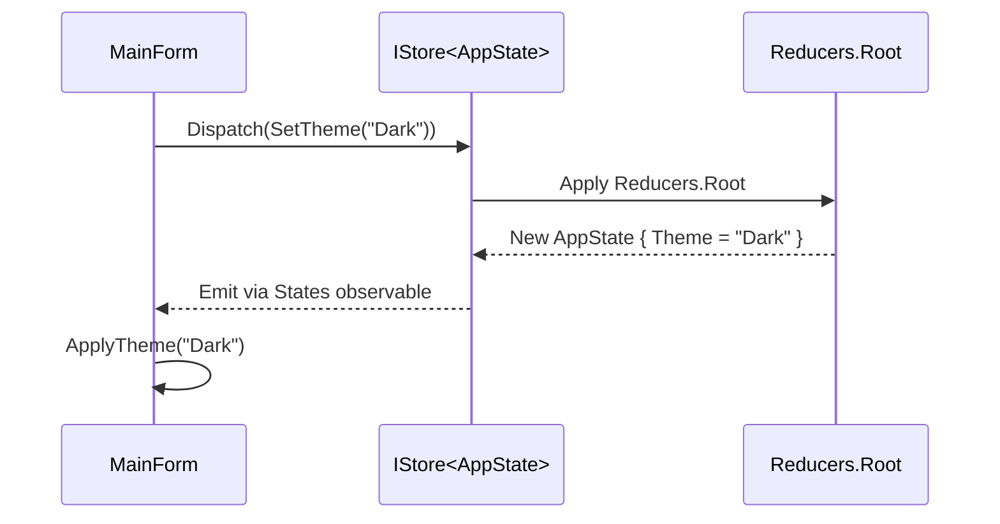

# State Store

AppAlling uses a **Redux-inspired state management system** to ensure all UI state and plugin-provided data flow are predictable, testable, and reactive.

## Core Concepts

### AppState

`AppState` is a single immutable record representing the entire application state.  
Plugins can extend `AppState` by adding their own slices (via reducer composition).

Example:

```csharp
public sealed record AppState(
    string Theme = "Light",
    // Plugin slices can be added here
    object? PluginState = null
);
```

---

### IStore\<TState>

The **store** is the single source of truth.
It exposes:

* **`Current`** – The current snapshot of the state.
* **`States`** – An `IObservable<TState>` that emits whenever the state changes.
* **`Dispatch(IAction)`** – Apply an action to update state via the reducer pipeline.

```csharp
public interface IStore<TState>
{
    TState Current { get; }
    IObservable<TState> States { get; }
    void Dispatch(IAction action);
}
```

---

### Reducers

Reducers are **pure functions** that take the current state + action and return a new state.
AppAlling provides a `Reducers.Root` static reducer to combine built-in and plugin-provided reducers.

```csharp
public static class Reducers
{
    public static AppState Root(AppState state, IAction action)
    {
        return action switch
        {
            SetTheme theme => state with { Theme = theme.Value },
            _ => state
        };
    }
}
```

---

## Example Workflow



---

## Observing State

The UI layer subscribes to `States` and reacts to changes:

```csharp
store.States
    .Select(s => s.Theme)
    .DistinctUntilChanged()
    .Subscribe(theme => ApplyTheme(theme));
```

This ensures the UI updates **only when relevant state changes**.

---

## Thread Safety

* **Dispatch** is thread-safe: actions can be dispatched from any thread.
* **States** observable uses a scheduler to ensure updates are delivered safely to the UI thread (via `ObserveOn` in the form constructor).

---

## Benefits

* **Predictable state flow** – Single source of truth.
* **Easy debugging** – You can log every action + resulting state.
* **Replayability** – Potential to implement time-travel debugging.
* **Testability** – Reducers are pure and can be unit-tested in isolation.

---

## Example: Theme Toggle

```csharp
// Action
public sealed record SetTheme(string Value) : IAction;

// Reducer
public static AppState Root(AppState state, IAction action)
    => action switch
    {
        SetTheme t => state with { Theme = t.Value },
        _ => state
    };

// Dispatch
store.Dispatch(new SetTheme("Dark"));
```

The UI automatically updates because it subscribed to `store.States`.

---

## Best Practices

* **Keep reducers pure** – No side-effects (I/O, MessageBoxes, etc.).
* **Use records** for state – Enables `with` expressions for immutability.
* **Group actions logically** – Prefer small, focused action types.
* **Prefer reactive updates** – Avoid directly mutating UI from outside the store.

---

## Related Topics

* [Architecture Overview](overview.md)
* [Command Bus](command-bus.md) *(if you plan to document command bus separately)*
